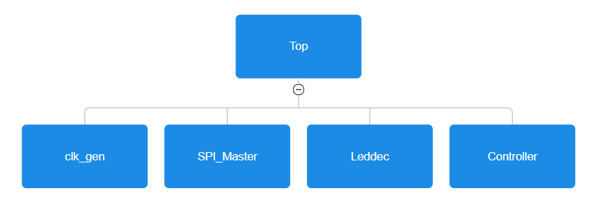
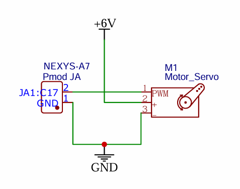

# CPE487 - FPGA-based accelerometer interface and feedback control system

### Overview :
This project involves developing a flight control system usesing the Nexys A7-100T FPGA, using its onboard ADXL362 3-axis accelerometer via SPI communication to continuously monitor real time X, Y, Z axis data. The system processes this sensor data to simulate aircraft orientation and generates a corresponding PWM signal to drive a servo motor, mimicking how flight surfaces like ailerons or rudders respond to pitch or roll movements. Sensor data is also displayed on the 7-segment display and onboard LEDs. The implementation showcases skills in finite state machines (FSMs), SPI protocol, signal generation, sensor interfacing, and real-time hardware communication.

 
 - Visual representation of a board's 3-axial data relative to an aircraft's rotations. This board is not the one used in class!

Expected outputs: 
Based on real-time tilt data from the onboard accelerometer (X, Y, and Z axes), the system will both display this data and respond by adjusting an external servo motor, simulating a flight control surface such as an aileron or rudder reacting to pitch or roll changes. Specifically, the system will: 
- Visually output via using the 16 onboard LEDs and the 7-segment display
- Functionally output by generating a PWM signal to control a servo motor

-----------------------
### Hierarchy of the files : 

- XDC file mapping clock signal, LEDs, 7‑segment display, ADXL362 pins, and Pmod (for PWM)
- top.vhd        — Top‑level entity instantiating all submodules
- clk_gen.vhd    — Generates 4 MHz clock from 100 MHz input
- spi_master.vhd — Implements a finite state machine (FSM) to manage SPI communication with the ADXL362 accelerometer, handling command sequences, data transmission, and synchronization logic.
- leddec16.vhd   — Packs and drives eight BCD digits on the seven‑segment display
- controller.vhd — Compares the X-axis tilt against set threshold to determine direction and generates a smooth 50Hz PWM signal for servo control

---------

## Getting Started
- The system takes input from the onboard ADXL362 3-axis accelerometer and the default 100 MHz clock signal. Outputs include real-time data visualization on the 7-segment display and the 16 onboard LEDs, as well as control of a servo motor through a PWM signal sent via the Pmod JA interface.
   -  Clock division was handled by a custom clk_gen.vhd module that divides the 100 MHz input clock down to 4 MHz using a simple counter-based divider.
   - SPI communication was implemented in spi_master.vhd via a hand-coded 92-state FSM, controlling every SPI timing signal (SCLK, MOSI, SS) and reading all 6 bytes (2 bytes per axis) using burst mode. No IP blocks were used for SPI — the FSM transitions were manually optimized for state latency and edge alignment with SCLK.
   - Each physical input/output was mapped using the .xdc file by matching get_ports constraints to pin numbers from the Digilent master XDC, such 
   - Initial testing was done incrementally. The SPI state machine was validated by assigning output registers (acl_dataX) directly to LEDs for binary visualization:
   - Later, display multiplexing and logic were added in leddec16.vhd, and seven-segment digits were verified through the bcd32 packaging. The project was synthesized, implemented, and the bitstream was uploaded using Vivado Hardware Manager, with hardware testing performed live on the board using physical switch flips, servo response, and live LED state analysis.
- VHDL code was written from scratch, starting with research into SPI communication and the ADXL362 sensor's functionality. Found a helpful [Youtube video](https://www.youtube.com/watch?v=7b3YwQWwvXM) which provided insight into interfacing the ADXL362 with the Nexys A7. Core components like FSMs, clock division, LED control, and 7-segment display logic were implemented using skills learned in the course. Additional research was conducted to understand how to generate PWM signals for servo motor control.

---------
## Implementation

### Data Collection (spi_master)
- Communicates with ADXL362 via SPI Mode 0 at 1 MHz clock
- Performs burst reads: 2 bytes per axis (X, Y, Z), totaling 6 bytes
- Implements a 92‑state FSM to configure and read sensor data
- Output data rates is 100 Hz with an acceleration range of ±2g

 

### Data Display
- **7‑Segment Display (leddec16)**
  - Converts each 5 bit axis value into two BCD digits via division/modulo.
  - Packs eight nibbles into a 32‑bit vector and time‑multiplexes across digits.
- **LED Array**
  - SW[2:0] chooses which axis to show: "001"→X, "010"→Y, "100"→Z.
  - Lights each LED bit high/low according to the raw binary data.

### Servo Control (controller)
- Compares X‑axis acceleration against ±threshold to decide left/center/right.
- Smoothly generates a PWM duty cycle corresponding to 1 ms, 1.5 ms, or 2 ms pulses at 50 Hz.
- Outputs `PWM_OUT` for hobby servo actuation.

---------
## Results

- Servo motor responds to X-axis tilt by adjusting its position via PWM signal
  

- 16 onboard LEDs display X-axis data in binary; gradual rotation increases or decreases the LED pattern accordingly

- 7-segment display shows real-time X, Y, and Z accelerometer values, with visible shifts toward minimum or maximum values as the board is rotated

---------
## Servo Circuit

- Schematic

- Physical circuit
  
---------
## Conclusion
- We both contributed equally across all aspects of the project. One of the major challenges we faced was establishing reliable SPI communication with the ADXL362 sensor. Issues included an unstable SCLK signal, inconsistent data transmission, and the CS pin unexpectedly going high during active communication. These problems were resolved through extensive debugging, trial and error, and hours of research to better understand VHDL behavior beyond just the logic structure. We also encountered unexplained flickering on LEDs 0 to 4 when displaying accelerometer data, particularly when the board was stationary—an issue that remains unresolved. Potential improvements for the project include allowing user selection of displayed axis data using onboard switches, integrating Y-axis input into the PWM control logic, implementing a PID algorithm for smoother control, and calculating the actual tilt angle from the raw accelerometer data.

- Check out our [presentation](Presentation.pdf)
  
---------
## Resources
- SPI / ADXL362/ NexysA7 logic [Youtube video](https://www.youtube.com/watch?v=7b3YwQWwvXM)
- [ADXL362 Datasheet](adxl362.pdf)
- [Nexys A7 Reference Manual](https://digilent.com/reference/programmable-logic/nexys-a7/reference-manual)

