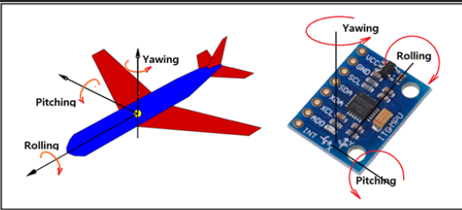
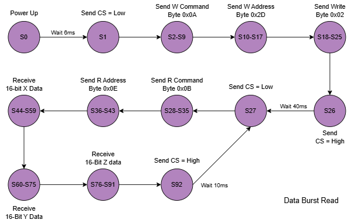

# CPE487Project - FPGA-based accelrometer interface and feedback control system

### Overview :
This project is in the progress of creating a flight control system that uses the Nexys A7-100T's ADXLK362 3-axis accelerometer via SPI communication protocol to process the sensor data, and displays it using the 7-segment display and onboard LEDs. A PWM signal is also generated to drive a servo motor based on real-time tilt detection, simulating a basic flight controller response. The system demonstrates skills in finite state machines (FSMs), SPI protocol, signal generation, sensor interfacing and hardware communication.

 
Visual representation of a board's 3-axial data relative to an aircraft's rotations. 

Expected outputs: 
Given the board's real time tilt data (on the x, y and z axis), the system is able to display that data and also adjust an external servo acting as a flight surface component like ailerons or rudders that respond to pitch or roll movements in an actual aircraft. More specifically, this system will : 
- Visually output via 16 onboard LEDs and a 7-segment display
- Functionally output by controlling a servo motor with PWM output

### Hierarchy of the files : 
- XDC file mapping clocks, LEDs, switches, 7‑segment display, and PWM pin
- top.vhd        — Top‑level entity instantiating all submodules
- clk_gen.vhd    — Generates 4 MHz clock from 100 MHz input
- spi_master.vhd — FSM for ADXL362 configuration and SPI data reads
- leddec16.vhd   — Packs and drives eight BCD digits on the seven‑segment display
- controller.vhd — Computes servo‑style PWM duty cycle from X‑axis acceleration

---------
## Implementation

### Data Collection (spi_master)
- Implements a 92‑state FSM at 1 MHz SPI clock to configure and read the ADXL362.
- Captures three 16‑bit axis values plus raw 15‑bit concatenation for LEDs.

 

### Data Display
- **7‑Segment Display (leddec16)**
  - Converts each 5 bit axis value into two BCD digits via division/modulo.
  - Packs eight nibbles into a 32‑bit vector and time‑multiplexes across digits.
- **LED Array**
  - SW[2:0] chooses which axis to show: "001"→X, "010"→Y, "100"→Z.
  - Lights each LED bit high/low according to the raw binary data.

### Servo Control (controller)
- Compares X‑axis acceleration against ±threshold to decide left/center/right.
- Smoothly slews a PWM duty cycle toward 1 ms, 1.5 ms, or 2 ms pulses at 50 Hz.
- Outputs `PWM_OUT` for hobby servo actuation.

### Modifications from Starter Code
- FSM was implemented from scratch based on the ADXL362 datasheet
- Used sign-extended 12-bit values, truncated to 5-bit unsigned for easier display
- Added switch-based axis selection logic for LED output
- PWM controller created using 'raw' data, not converted yet

### Resources
- SPI FSM Walkthrough : (https://www.youtube.com/watch?v=7b3YwQWwvXM)
- ADXL362 Datasheet (https://www.analog.com/media/en/technical-documentation/data-sheets/adxl362.pdf)
- Digilent VHDL Reference (https://github.com/Digilent/Nexys-A7-100T-OOB/blob/master/src/hdl/AccelerometerCtl.vhd)
- (not used in code) PID Controller GitHub (ps://github.com/deepc94/pid-fpga-vhdl/tree/master)
- SPI Protocol Tutorial (https://www.corelis.com/education/tutorials/spi-tutorial/)

